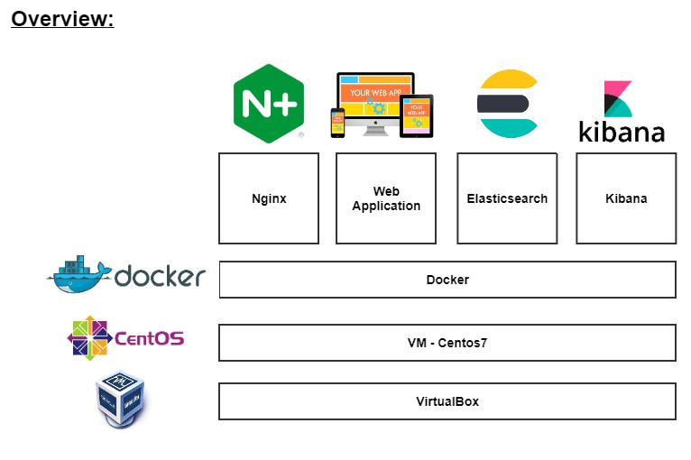
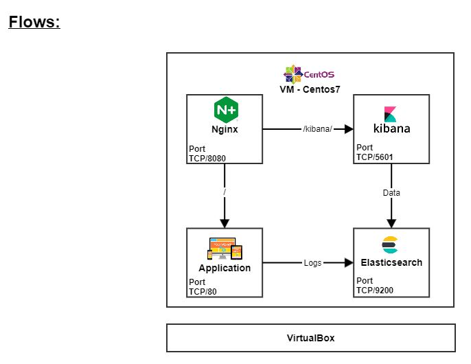

# BlueVine - Home assignment

# Assignment

# Solution
The Solution that I choosed is docker based.

# Diagrams

# Components
- VirtuelBox as Virtual infrastructure
- VM running Centos7 as server
- docker
  - container - nginx
  - container - backend web application
  - container - Elasticsearch
  - container - Kibana

# Flows
- nginx -> Kibana (http://Docker_IP/kibana/)
- nginx -> backend (http://Docker_IP/)
- backend -> Elasticsearch for logs
- Kibana -> Elasticsearch to present the logs

  
# Setup Files
- nginx image creation - 01-nginx.txt
- backend application image creation - 02-backend.txt
- Elasticsearch image creation - 03-Elasticsearch.txt
- Kibana image creation - 04-Kibana.txt
- Installation and launch commands - 05-Installation.txt
  - VirtualBox
  - VM with Centos OS
  - Docker
  - nginx
  - backend web application
  - Elasticsearch
  - Kibana
